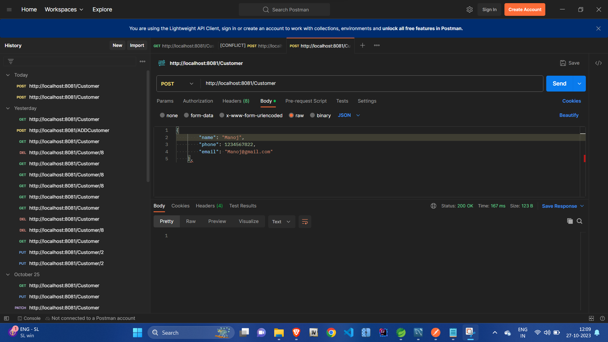
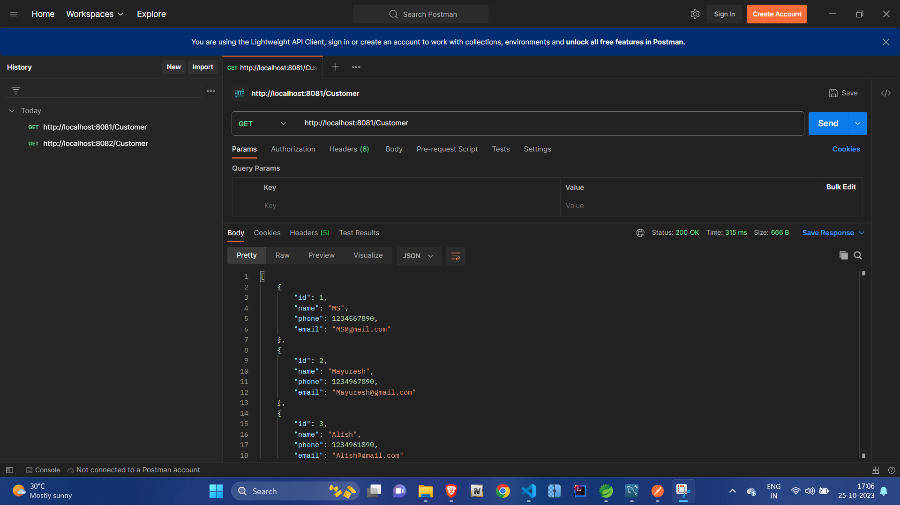
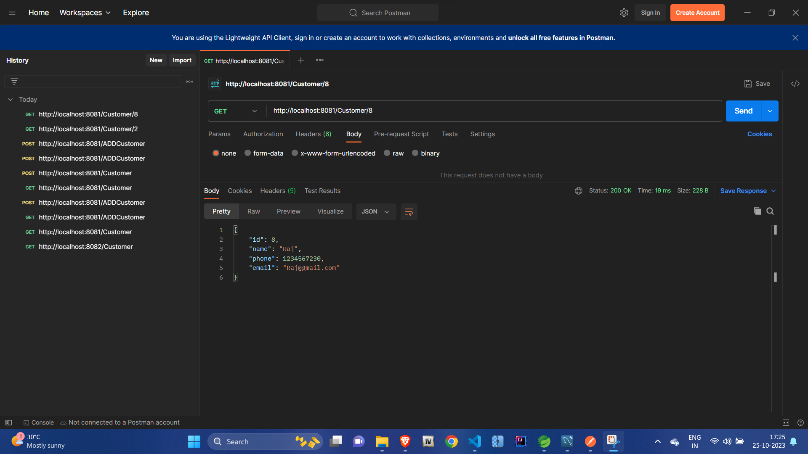
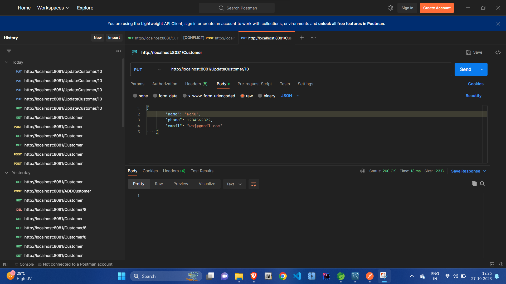
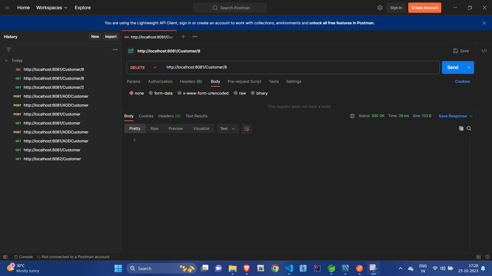

# 🏬 Shopping Mall Management – Customer Module  

This project is part of the **Shopping Mall Management System**, developed as the **final project** during my **Java Full Stack Training Program** at **TNS India Foundation**.  

I was responsible for building the **Customer Module**, which manages customer data and operations. The module is developed using **Java, Spring Boot, Hibernate, and MySQL**, and tested with **Postman**.  

---

## 🛠️ Tech Stack  

<p align="left">
  
  
  
  
  
</p>

---

## ✨ Features (Customer Module)  

- ➕ Add a new customer  
- 📖 View customer details  
- ✏️ Update existing customer information  
- ❌ Delete customer records  
- 🔎 Fetch customer by ID  
- 🌐 Tested APIs with **Postman**  

---

## ✍️ My Contribution  

During this project, I was specifically assigned the **Customer Module** where I:  

- Designed and implemented **CRUD operations** using **Spring Boot + Hibernate**.  
- Connected the application to a **MySQL database** for persistence.  
- Created **REST APIs** for customer management.  
- Tested and validated all APIs using **Postman**.  
- Ensured clean and maintainable code following industry practices.  

---

## 🚀 Getting Started (Run Locally)  

### 🔹 Prerequisites  
- Install **Java 8+**  
- Install **MySQL** and create a database (e.g., `shopping_mall`)  
- Install **Maven**  
- Postman for API testing  

---

### 🔹 Setup & Run  

```bash
# Clone the repository
git clone https://github.com/Mayuresh3843/Shopping-mall-management.git
cd Shopping-mall-management

# Update MySQL credentials in application.properties
spring.datasource.url=jdbc:mysql://localhost:3306/shopping_mall
spring.datasource.username=yourusername
spring.datasource.password=yourpassword

# Build and run the project
mvn spring-boot:run

```

## 📬 API Endpoints (Customer Module)


<h3>➕ Add new customer</h3>

```bash
POST /customers
```

 <h3>📖 Fetch all customers</h3>
 
```bash
GET /customers
```

 <h3>🔎 Get customer by ID</h3>
 
```bash
GET /customers/{id}
```

<h3>✏️ Update customer</h3>

```bash
PUT /customers/{id}
```

<h3> ❌ Delete customer</h3>

```bash
DELETE /customers/{id}
```

## 📸 API Testing with Postman

### 
  

### 
  

### 
  

### 
  

### 
  


